# Proyecto: ```Aplicaciones para el gimnasio de la UFRO```

Durante la cursada en la asignatura ```Ingeniería de Software```, se nos encomendó diseñar una plataforma de escritorio y web con un propósito de nuestra elección. Para contribuir a la Universidad de la Frontera (UFRO), se decidió crear un proyecto para el gimnasio de la institución. El objetivo del proyecto es permitir que los socios del gimnasio puedan inscribirse en clases impartidas por profesionales, y que estas sean gestionadas por un administrador, junto con otras funcionalidades. Se comenzó con el proyecto diseñando la plataforma de escritorio con WindowBuilder y Java, utilizando la biblioteca Javax.Swing. A medida que se avanzaba en la asignatura, migrar la versión de escritorio a una plataforma web se convirtió en un requisito obligatorio, por lo que se ocuparon frameworks para Java como SpringMVC para separar la lógica y los modelos de la vista, e Hibernate para conectarnos a la base de datos. Es importante destacar que las imágenes que se muestran a continuación son sólo representativas y que los casos de uso completos de las aplicaciones están reservados. También es importante mencionar que la plataforma web es un prototipo y que la versión actualizada se ha desarrollado en 2023.

Si algún reclutador está interesado en obtener más detalles o visualizar las aplicaciones en funcionamiento, puede ponerse en contacto conmigo a través de mi correo 
electrónico: manriquezfernando.ns@gmail.com

### Stack de tecnologías.
<p align="center">
  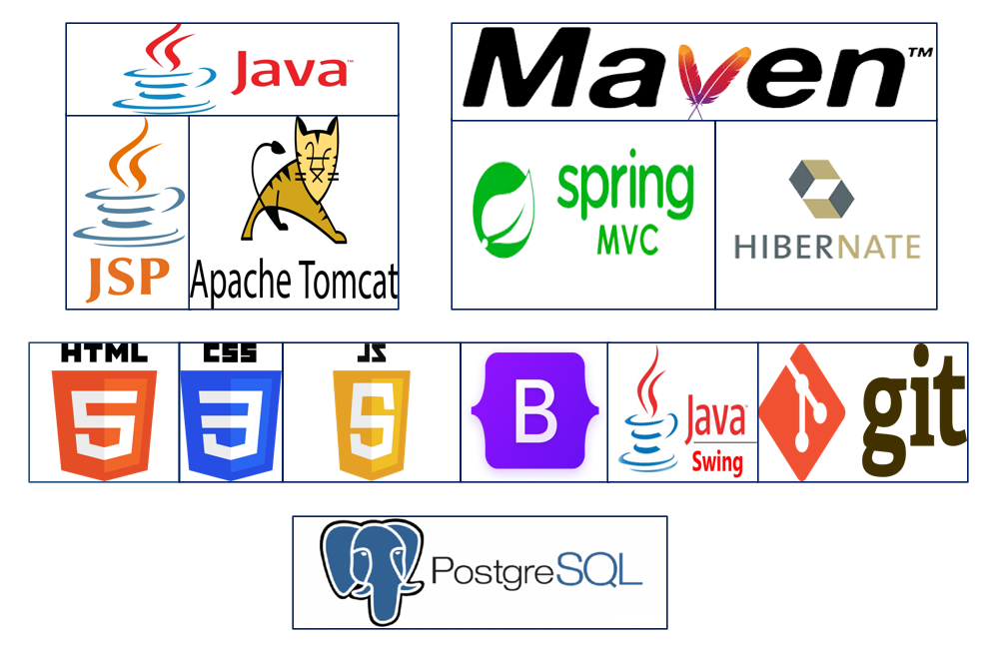
</p>


### ```Login's``` de las aplicaciones.

A continuación se muestran las imágenes correspondientes a los inicio de sesión tanto de la versión de escritorio como de la plataforma web del proyecto para el gimnasio de la Universidad de la Frontera (UFRO). Es importante mencionar que el sistema se conectó a una base de datos local PostgreSQL para su correcto funcionamiento.
<p align="center">
  
</p>
<p align="center">
  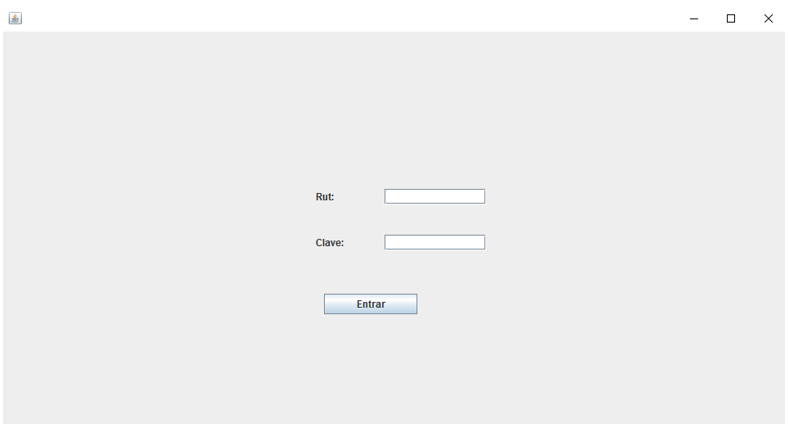
</p>

#### Es importante mencionar que ambas aplicaciones cuentan con tres tipos de cuenta distintos que heredan de una clase común denominada ```Usuario```. Debido a esto, las siguientes secciones se organizarán en función de estos tres tipos de cuenta para brindar una mejor comprensión de las funcionalidades y características de cada uno de ellos.
## Tipo de cuenta: ```Administrador```
El Administrador es fundamental en la gestión del sistema, ya que su principal función es agregar clases al mismo. Para ello, resulta indispensable que hayan Profesionales disponibles en el sistema, ya que son ellos quienes se encargarán de impartir dichas clases en el gimnasio.

### Vista gráfica ```Inicio```
<p align="center">
  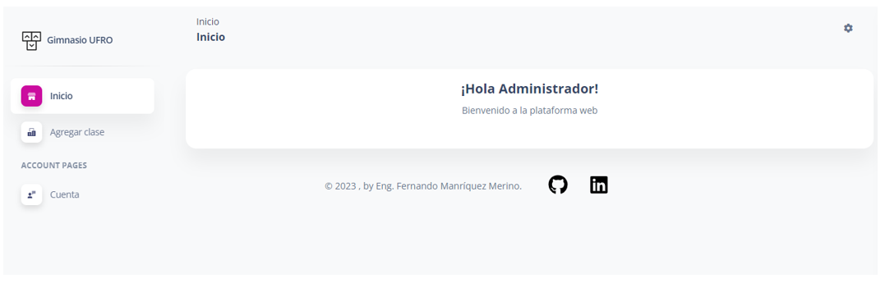
</p>
<p align="center">
  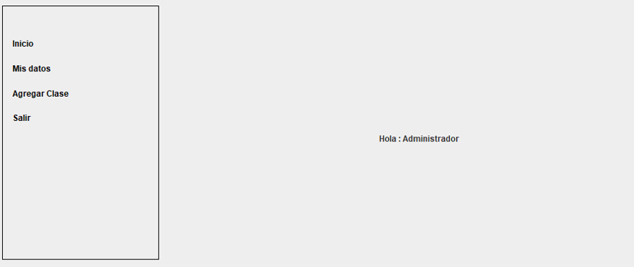
</p>

### Vista gráfica ```Agregar clase```
<p align="center">
  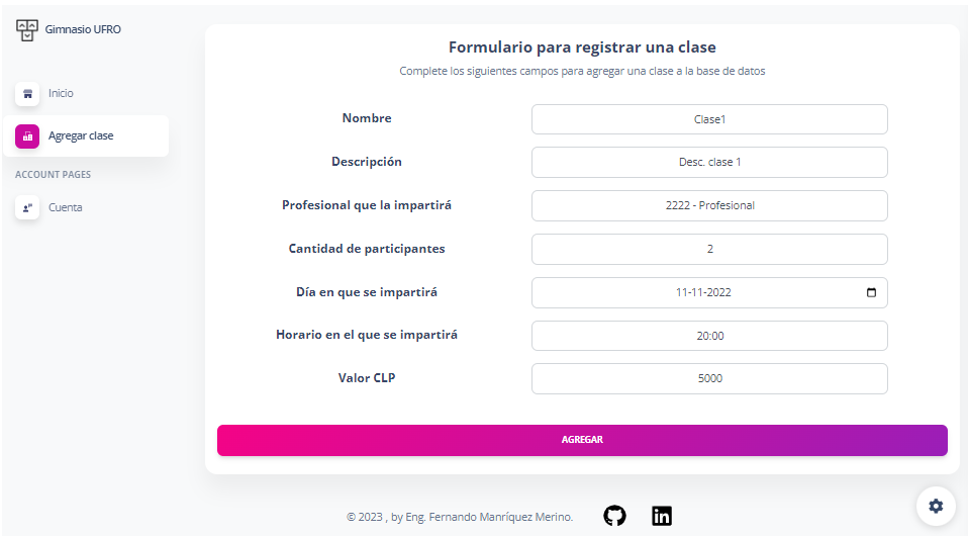
</p>
<p align="center">
  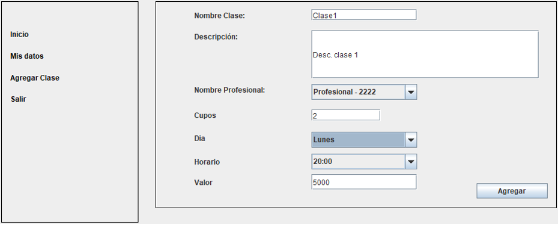
</p>

## Tipo de cuenta: ```Socio```
En cuanto al tipo de cuenta ```Socio```, cabe destacar que se trata de una opción que permite a las personas inscribirse en las clases que han sido previamente registradas por el ```Administrador``` y que están siendo impartidas por un ```Profesional```. De esta manera, los socios pueden acceder a una amplia variedad de clases y actividades físicas dentro del gimnasio, adaptándose a sus requerimientos y preferencias.

### Vista gráfica ```Reservar inscripción```
<p align="center">
  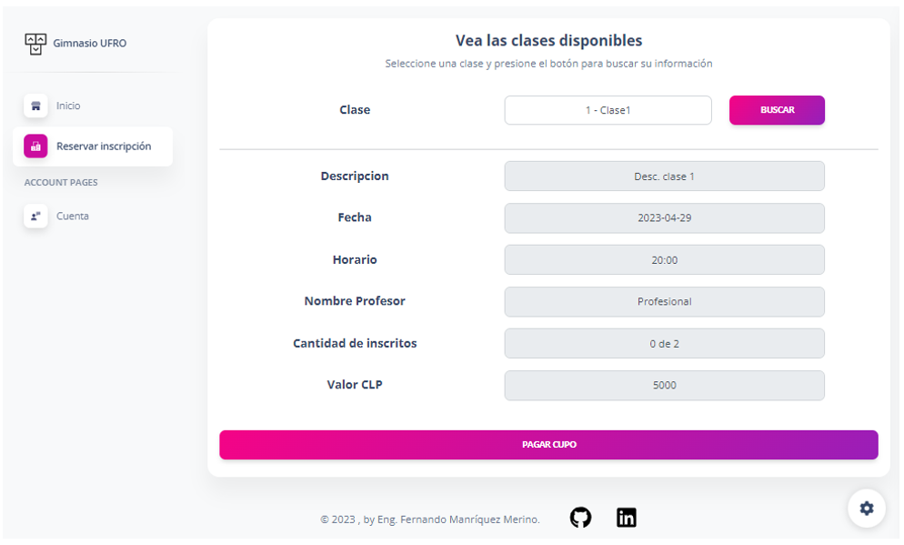
</p>
<p align="center">
  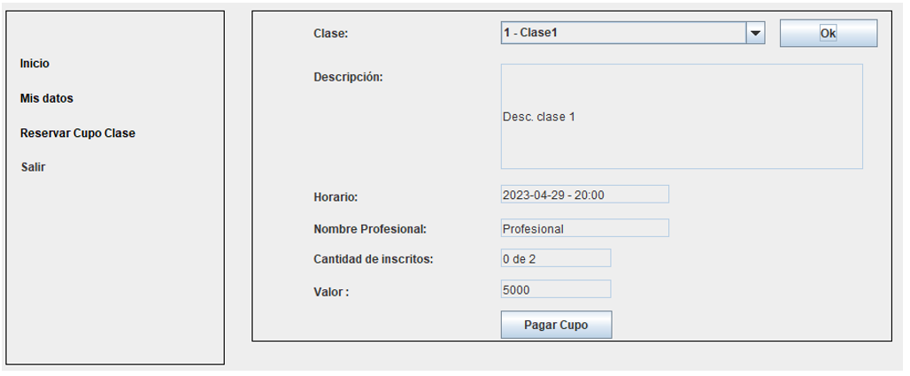
</p>

### Vista gráfica ```Transferencia```
<p align="center">
  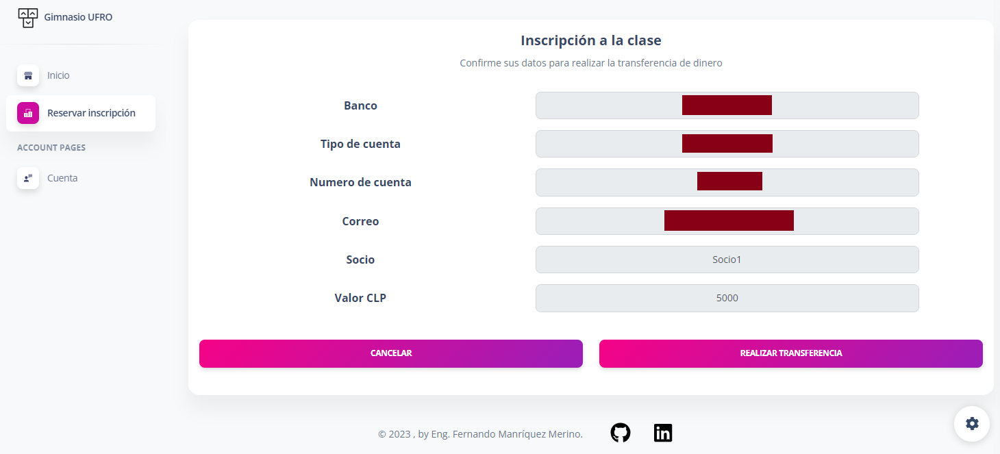
</p>
<p align="center">
  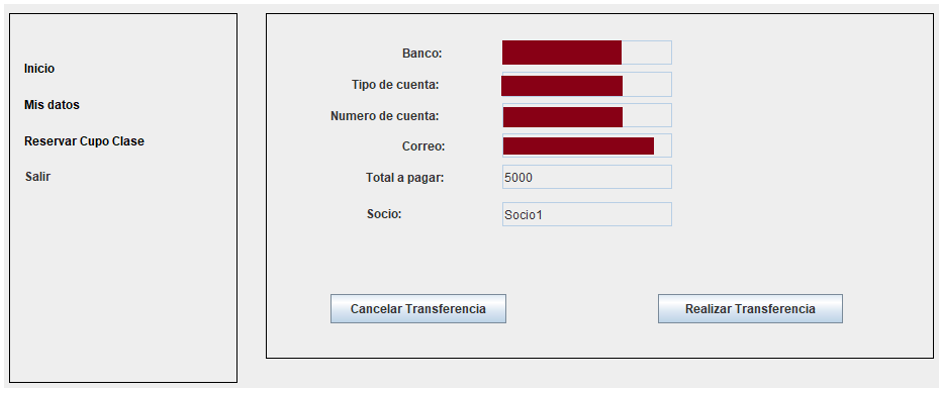
</p>

## Tipo de cuenta: ```Profesional```
Como ya se ha mencionado en secciones anteriores, el ```Profesional``` es la persona encargada de impartir las clases. Por lo tanto, aquellos usuarios que poseen una cuenta de tipo ```Profesional``` tienen la capacidad de visualizar quiénes se han registrado en sus clases.

### Vista gráfica ```Clases asignadas```
<p align="center">
  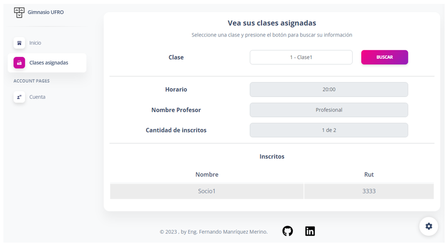
</p>
<p align="center">
  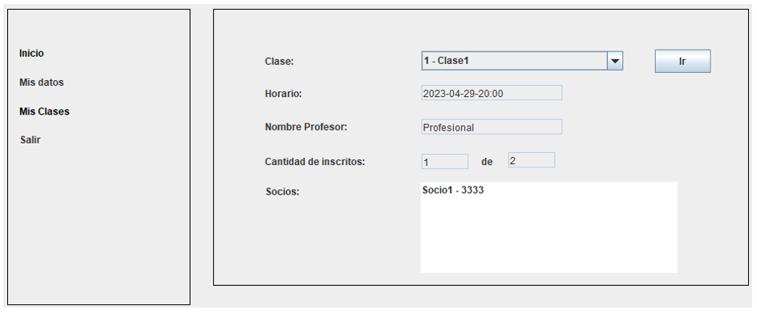
</p>