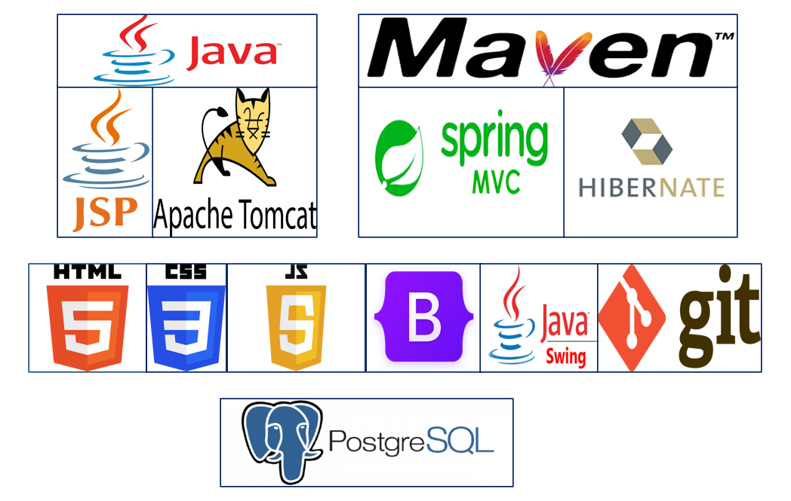

# Proyecto "Plataforma web para el gimnasio de la Universidad de La Frontera"

Durante la cursada de la asignatura de Ingeniería de software, se nos encomendó un proyecto de asignatura que tuvo como objetivo el diseño de una plataforma de escritorio y web. 
Para llevar a cabo esta tarea, iniciamos con el diseño de la plataforma de escritorio utilizando WindowBuilder y la biblioteca Javax.Swing. Conforme avanzamos en la asignatura, 
procedimos a migrar la versión de escritorio a web, como se puede apreciar en las imágenes que se adjuntan a continuación.

Cabe destacar que el diseño de la base de datos y los casos de uso totales de las aplicaciones se mantienen en reserva. Si algún reclutador está interesado en obtener más detalles o 
visualizar las aplicaciones en funcionamiento, puede contactarme a través del correo electrónico indicado.

### Stack de tecnologías.

  

